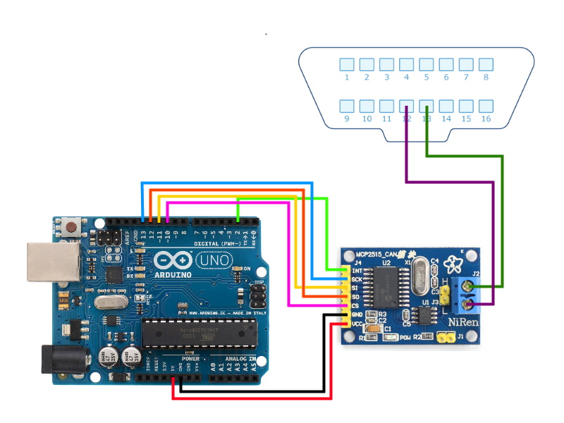

# ArdLeaf
An arduino library for reading information from a Nissan Leaf ev-canbus, supports MCP2515 controllers.
Includes an application that displays information like speed, power consumption and current gear.

This is a personal project, so there isn't much documentation.

ArdLeaf uses files from the MCP_CAN library by coryjfowler https://github.com/coryjfowler/MCP_CAN_lib 
(These files come with this library).

This README will be updated with more information when I have time.

## Installation
1. Download the ZIP from https://github.com/danmrdj/ardleaf/releases/latest/
2. Open Arduino, do Sketch > Include Library > Add .ZIP Library and select the zip file.
3. Upload the "ArdLeaf_Read" example from File > Examples > ArdLeaf

## Application
When starting the application, it will search through all com ports until it finds an arduino.

This is being developed on a 2011 Nissan Leaf ZE0, using the diagram below.

