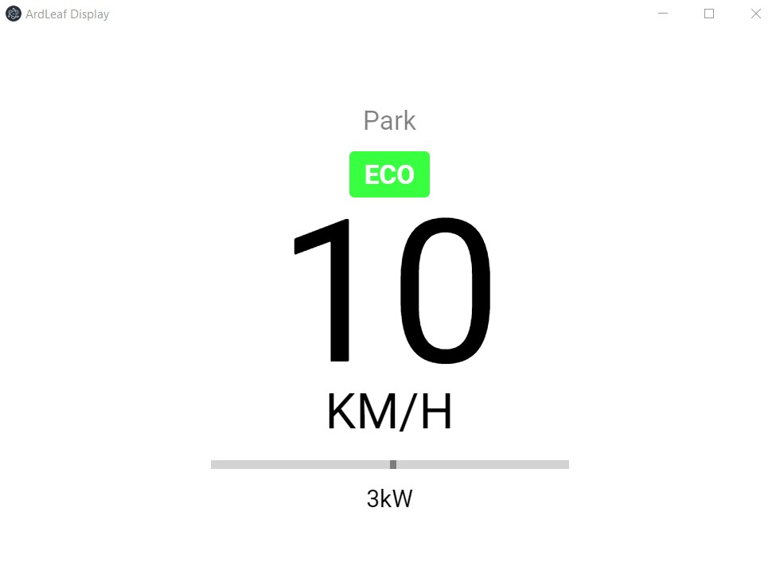

# ArdLeaf
An arduino library for reading information from a Nissan Leaf canbus.
Includes an application that displays information like speed, power consumption and current gear.

This is a personal project, so there isn't much documentation.

ArdLeaf uses files from the MCP_CAN library by coryjfowler https://github.com/coryjfowler/MCP_CAN_lib 
(These files come with this library).

This README will be updated with more information when I have time.

## Installation
1. Download the ZIP from https://github.com/danmrdj/ardleaf/releases/latest/
2. Extract the ZIP file
3. Copy the "ArdLeaf_Library" folder to your arduino libraries folder
4. The application .exe file can be found in the "ArdLeaf_Application-win32-x64" folder.

## Application
When starting the application, it will search through all com ports until it finds an arduino.

